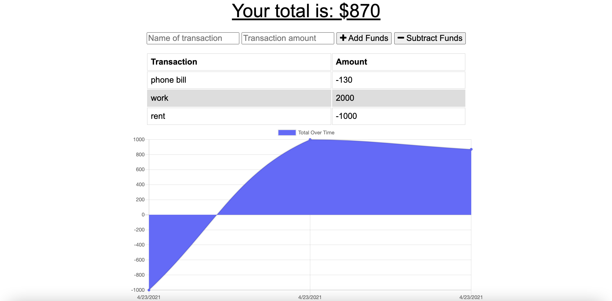
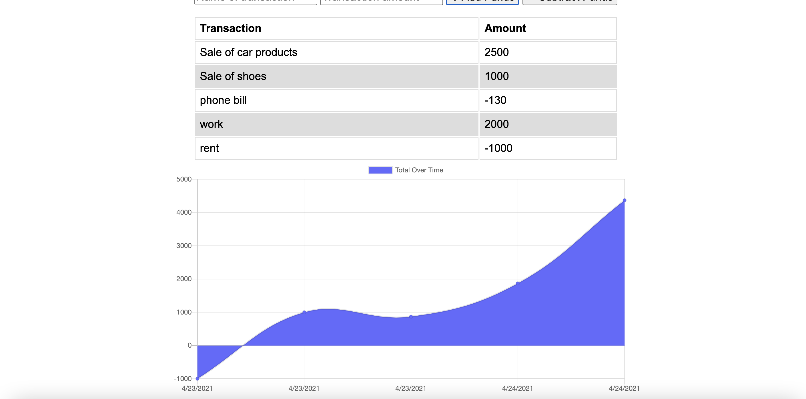
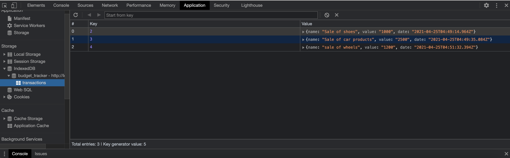

### Budget Tracker 
  
## Description
As a avid traveler
I want to be able to track my withdrawals and deposits with or without a data/internet connection
so that my account balance is accurate when I am traveling and able to see all transtions without being lost.

  ##  Table of Contents
  * [Installation](#installation)
  * [Usage](#usage)
  * [License](#License)
  * [Contributing](#contributing)
  * [Tests](#Tests)
  * [Questions](#questions)
  
  ## Usage
  In order to run this application, you must fork my repo to your local machine and and run npm start to run the application, then on then open a browser tab and in the url we will be using "http://localhost:3001/".
  
  
  # License
  This project is  licensed MIT license.
  
  ## Contributing
  Contributors: N/A
  ## Test
  The following is needed to run the test: `npm start`.
  ## Questions
  If you have any questions regarding about the application, please contact me https://github.com/alexreveles or alexreveles@yahoo.com thank you.

### 
### https://github.com/alexreveles/budget-tracker
### https://github.com/alexreveles

